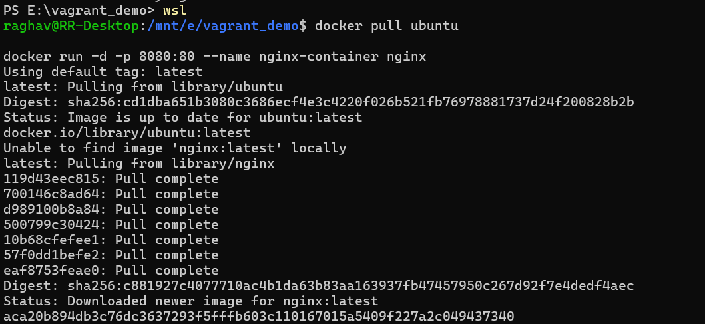
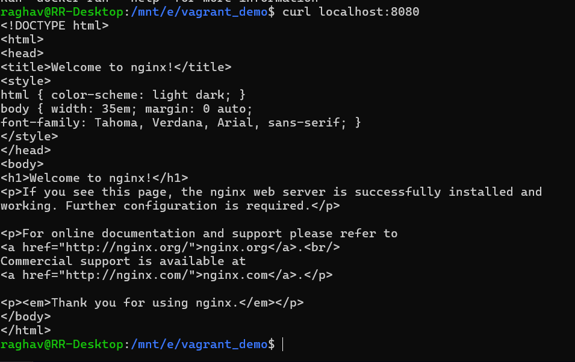
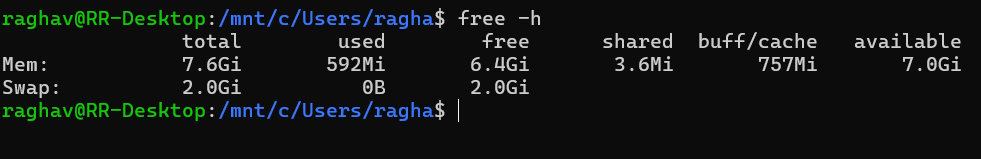

# Lab Report: Comparison of Virtual Machines (VMs) and Containers

---

## **1. Objective**
The primary goals of this experiment are:
* To understand the conceptual and practical differences between Virtual Machines (VMs) and Containers.
* To install and configure an Ubuntu-based Nginx web server using both VirtualBox/Vagrant and Docker inside WSL.
* To compare resource utilization, performance, and operational characteristics of both environments.

---

## **2. Hardware and Software Requirements**
### **Hardware**
* 64-bit system with virtualization support enabled in BIOS.
* Minimum 8 GB RAM (4 GB acceptable).
* Internet connection.

### **Software**
* Oracle VirtualBox and Vagrant.
* Windows Subsystem for Linux (WSL 2) with Ubuntu distribution.
* Docker Engine (docker.io).

---

## **3. Theory**
| Feature | Virtual Machine (VM) | Container |
| :--- | :--- | :--- |
| **Virtualization Level** | Emulates complete hardware and kernel. | Virtualizes at the OS level, sharing the host kernel. |
| **Isolation** | Strong (Full OS isolation). | Moderate (Process-level isolation). |
| **Resource Usage** | Higher (Requires dedicated RAM/CPU for guest OS). | Lightweight and efficient. |
| **Startup Time** | Slower (Minutes). | Fast (Seconds). |

---

## **4. Experiment Setup - Part A: Virtual Machine**

### **Step 1: Initialization and Deployment**
Using Vagrant, an Ubuntu VM was initialized and started.
* **Command:** `vagrant init ubuntu/jammy64` followed by `vagrant up`.

> *Observation: The system downloads the base box and configures the VirtualBox provider.*

### **Step 2: Accessing the VM and Installing Nginx**
Once the VM was running, SSH was used to access the terminal, and Nginx was installed via the package manager.

> *Observation: Running `sudo apt update` and `sudo apt install -y nginx` inside the guest OS.*

> *Observation: Service configuration complete within the Ubuntu Jammy environment.*

---

## **5. Experiment Setup - Part B: Containers (Docker)**

### **Step 1: Running the Container**
The Docker engine was used to pull the Ubuntu image and deploy a containerized Nginx instance.
* **Command:** `docker run -dp 8080:80 --name nginx-container nginx`.

> *Observation: Docker pulls the image layers and starts the container nearly instantaneously.*

### **Step 2: Verification**
The Nginx server was verified by accessing the mapped port on the localhost.

> *Observation: The `curl` command confirms the Nginx "Welcome" page is active on port 8080.*

---

## **6. Resource Utilization & Comparison**

### **Observation Commands**
* **VM:** `free -h`, `htop`.
* **Container:** `docker stats`.

### **Comparison Results**

| Parameter | Virtual Machine | Container |
| :--- | :--- | :--- |
| **Boot Time** | High | Very Low |
| **RAM Usage** | High | Low |
| **CPU Overhead** | Higher | Minimal |
| **Disk Usage** | Larger | Smaller |
| **Isolation** | Strong | Moderate |

> *Observation: The containerized Nginx uses only ~13.22 MiB of RAM, demonstrating extreme efficiency compared to a full VM.*

---

## **7. Conclusion**
The experiment validates that **Containers** are significantly more lightweight and resource-efficient, making them ideal for microservices and rapid deployment. However, **Virtual Machines** remain superior for workloads requiring full OS isolation or legacy kernel requirements.

---

## **8. Viva Voce Answers**
1.  **Main Difference:** VMs virtualize hardware and run a full OS; containers virtualize the OS and share the host kernel.
2.  **Fast Startup:** Containers do not need to boot a guest kernel; they start as a namespaced process.
3.  **Hypervisor Role:** The hypervisor creates and runs VMs, providing hardware abstraction.
4.  **Different Kernels:** Generally, no. Containers share the host OS kernel.
5.  **Docker Lightweight:** It eliminates the overhead of a full guest OS, utilizing shared resources and layered images.