# Experiment 12 — Study and Analyse Container Orchestration using Kubernetes

## Objective
To understand why Kubernetes is used for container orchestration and learn how to deploy, scale, and manage applications using Kubernetes commands. 
---

# Theory

## Why Kubernetes over Docker Swarm?

| Reason | Explanation |
|------|-------------|
| Industry Standard | Most companies use Kubernetes |
| Powerful Scheduling | Automatically decides where to run applications |
| Large Ecosystem | Many tools and plugins available |
| Cloud Native Support | Works on AWS, Google Cloud, Azure, etc. |

Kubernetes has become the **dominant orchestration platform for modern cloud applications**. 

---

# Core Kubernetes Concepts

| Docker Concept | Kubernetes Equivalent | Meaning |
|---|---|---|
| Container | Pod | Smallest deployable unit containing one or more containers |
| Compose Service | Deployment | Describes how applications run and how many replicas |
| Load Balancer | Service | Exposes application to external traffic |
| Scaling | ReplicaSet | Ensures a desired number of pods run |

A **Pod** is the smallest execution unit in Kubernetes.  
A **Deployment** manages pod creation and scaling.  
A **Service** exposes pods to users or other services.
---

# Hands-On Lab

This lab assumes:

- `kubectl` installed
- Kubernetes cluster running (Minikube or k3d)

---

# Task 1 — Create a Deployment

A Deployment specifies:

- container image
- number of replicas
- labels used to identify pods

Create file:

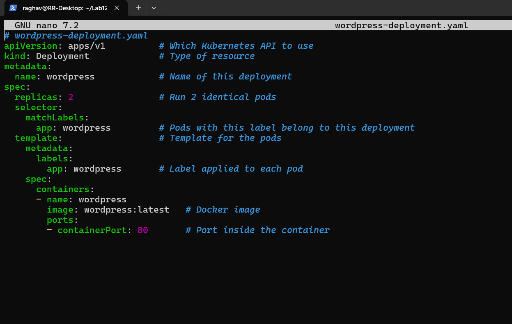

Apply deployment:

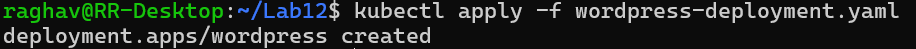

Kubernetes will create **two pods running WordPress**. 

---

# Task 2 — Expose the Deployment

Pods are temporary and may change.  
A **Service** provides a stable network endpoint.

Create file:

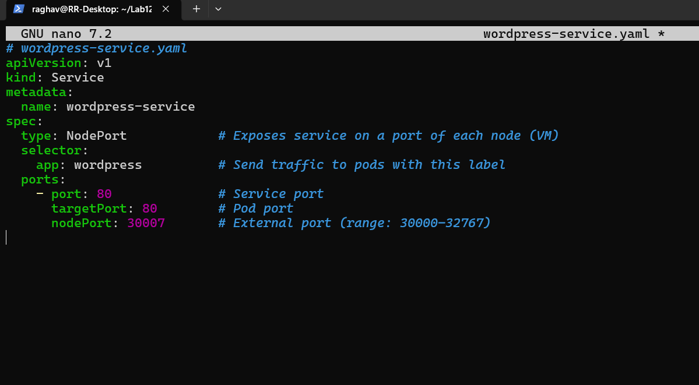

Apply service:

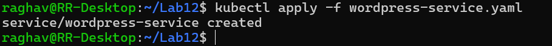

The application is now accessible via a node port. 

---

# Task 3 — Verify Deployment

Check pods:

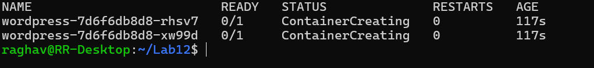

Expected output:

```
NAME READY STATUS RESTARTS AGE
wordpress-xxxxx-yyyyy 1/1 Running 0 1m
wordpress-xxxxx-zzzzz 1/1 Running 0 1m
```

Check service:

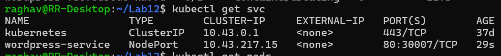
Example output:

```
NAME TYPE CLUSTER-IP PORT(S)
wordpress-service NodePort 10.43.x.x 80:30007/TCP
```

Access application:

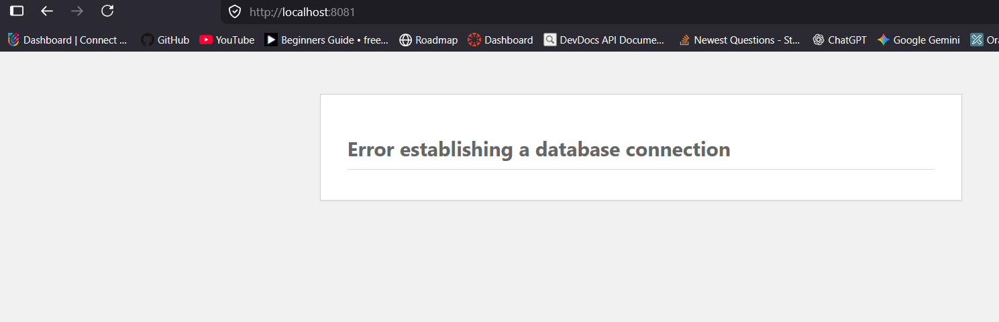

Node IP can be obtained using:

```
minikube ip
```

or using `localhost` for k3d clusters.

---

# Task 4 — Scale the Deployment

Increase replicas from **2 to 4**:

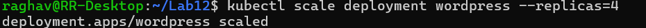

Verify:

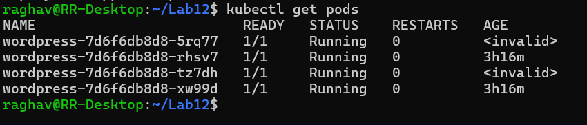

Four pods should now be running.

Scaling allows the application to handle **higher traffic and improved performance**. 

---

# Task 5 — Self-Healing Demonstration

Kubernetes automatically replaces failed pods.

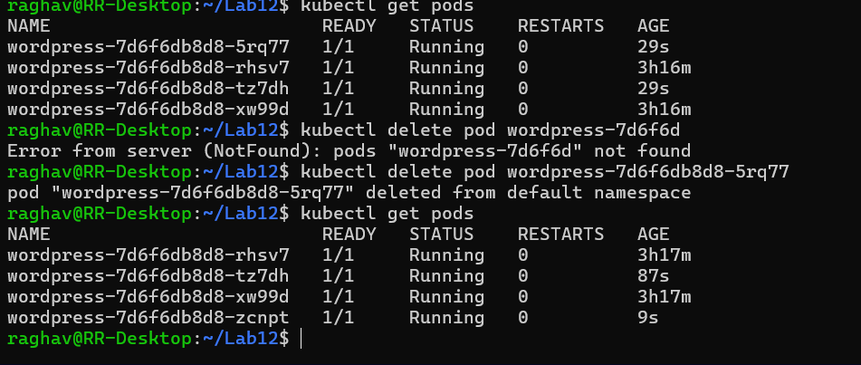

A new pod will automatically be created to maintain the desired number of replicas.

This demonstrates **Kubernetes self-healing capability**. 

---

# Docker Swarm vs Kubernetes

| Feature | Docker Swarm | Kubernetes |
|---|---|---|
| Setup | Easy | More complex |
| Scaling | Basic | Advanced |
| Ecosystem | Small | Large |
| Industry Use | Rare | Standard |

Kubernetes is the **industry standard orchestration platform**. :contentReference[oaicite:9]{index=9}

---

# Advanced Lab — Real Cluster with kubeadm

Requirements:

- 2–3 virtual machines
- Ubuntu 22.04 or later
- 2 CPU and 2GB RAM per node

Install required tools:

```bash
sudo apt update
sudo apt install -y apt-transport-https ca-certificates curl
```

Install Kubernetes components:

```bash
sudo apt install -y kubeadm kubelet kubectl
```
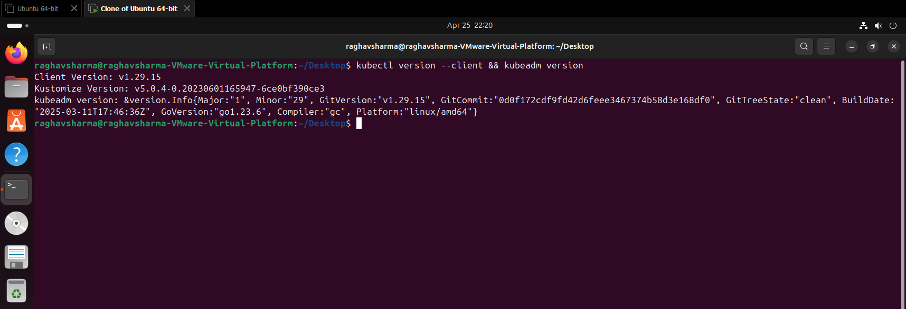  


Initialize cluster on master node:

```bash
sudo kubeadm init
```
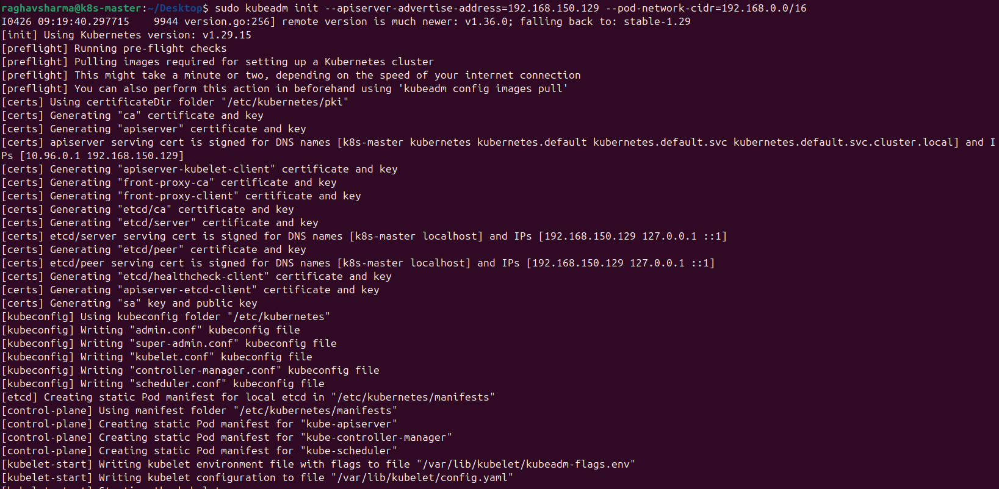  
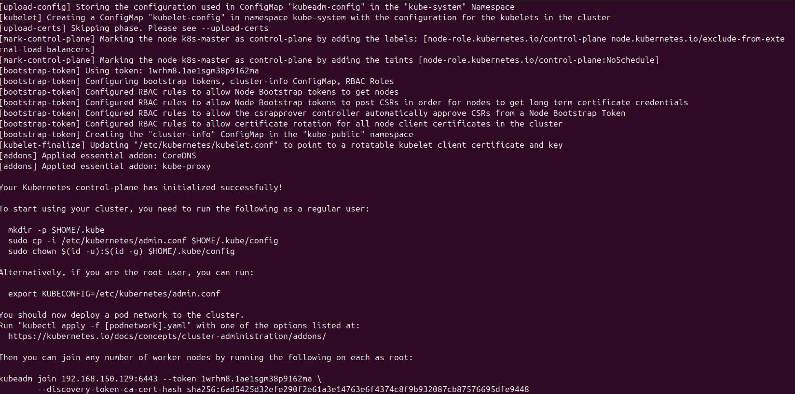

Configure kubectl:

```bash
mkdir -p $HOME/.kube
sudo cp /etc/kubernetes/admin.conf $HOME/.kube/config
sudo chown $(id -u):$(id -g) $HOME/.kube/config
```
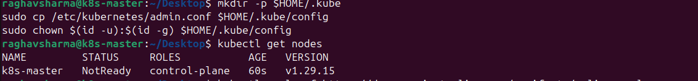  


Install networking plugin:

```bash
kubectl apply -f https://docs.projectcalico.org/manifests/calico.yaml
```  
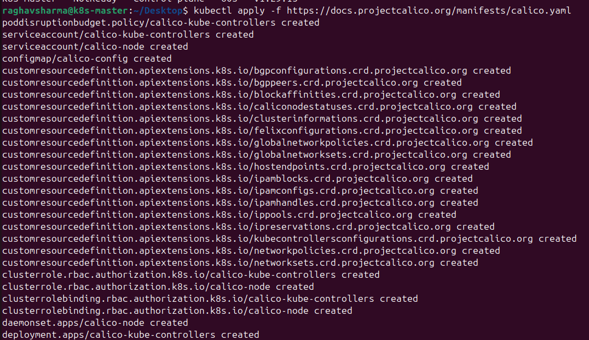  


Join worker nodes using generated token:

```bash
kubeadm join <master-ip>:6443 --token <token>
```
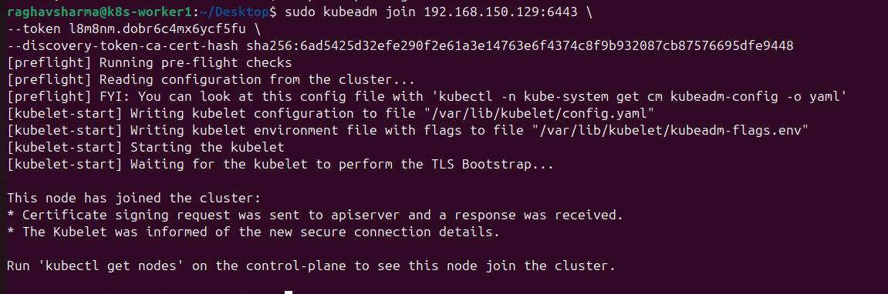

Verify cluster:

```bash
kubectl get nodes
```
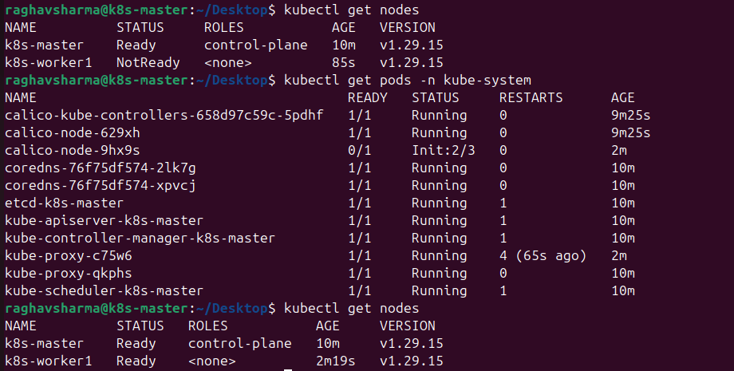 


Expected output shows master and worker nodes ready. :contentReference[oaicite:10]{index=10}

---

# Kubernetes Command Cheat Sheet

| Goal | Command |
|---|---|
| Apply YAML file | kubectl apply -f file.yaml |
| See pods | kubectl get pods |
| See services | kubectl get svc |
| Scale deployment | kubectl scale deployment <name> --replicas=N |
| Delete pod | kubectl delete pod <pod-name> |
| See nodes | kubectl get nodes |

---

# Conclusion

In this experiment we:

- studied Kubernetes architecture
- deployed WordPress using Deployment and Service
- scaled the application using replicas
- demonstrated self-healing functionality
- explored real cluster setup using kubeadm

Kubernetes provides powerful container orchestration features including automated deployment, scaling, and recovery of applications.
