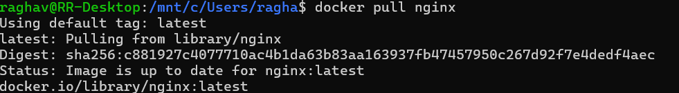
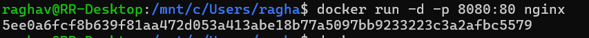
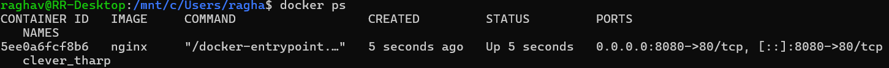
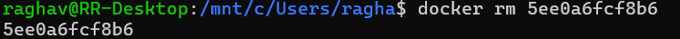
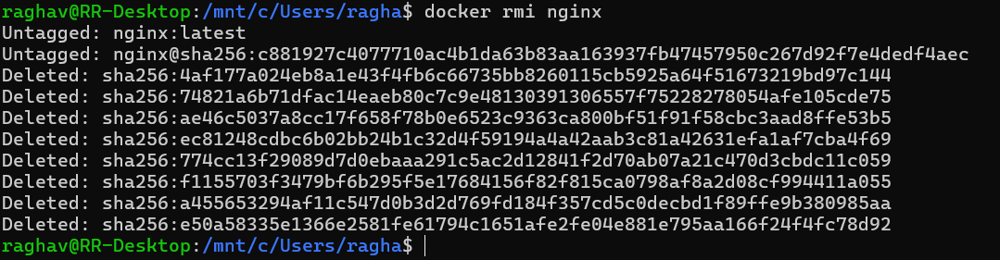

# Lab Report: Experiment 2
## [cite_start]Docker Installation, Configuration, and Running Images [cite: 5]

[cite_start]**Date:** 2/2/2026 [cite: 21]  
**Author:** Raghav Sharma

---

## 1. Objective
The objective of this lab is to:
* [cite_start]Pull Docker images [cite: 7]
* [cite_start]Run containers [cite: 8]
* [cite_start]Manage container lifecycle [cite: 9]

---

## 2. Procedure and Results

### Step 1: Pull Image
[cite_start]The first step involves fetching the Nginx image from Docker Hub[cite: 11].
* [cite_start]**Command:** `docker pull nginx` [cite: 12]

**Execution Screenshot:**

---

### Step 2: Run Container with Port Mapping
[cite_start]The container is started in detached mode with host port 8080 mapped to container port 80[cite: 13, 14].
* [cite_start]**Command:** `docker run -dp 8080:80 nginx` [cite: 14]

**Execution Screenshot:**

---

### Step 3: Verify Running Containers
[cite_start]To confirm the container is active and check the assigned status and ports, the `ps` command is used[cite: 15].
* [cite_start]**Command:** `docker ps` [cite: 16]

**Execution Screenshot:**

---

### Step 4: Stop and Remove Container
[cite_start]To manage the lifecycle, the container is stopped first and then removed using its ID[cite: 24, 25].
* [cite_start]**Stop Command:** `docker stop 5ee0a6fcf8b6` [cite: 25]
* [cite_start]**Remove Command:** `docker rm 5ee0a6fcf8b6` [cite: 25]

**Stop Screenshot:**

**Remove Screenshot:**

---

### Step 5: Remove Image
[cite_start]The final step in the lifecycle management is removing the image from the local repository[cite: 26, 27].
* [cite_start]**Command:** `docker rmi nginx` [cite: 27]

**Execution Screenshot:**

---

## 3. Result and Conclusion
### Result
[cite_start]Docker images were successfully pulled, containers executed, and lifecycle commands performed[cite: 29, 30].

### Overall Conclusion
[cite_start]This lab demonstrated containerization using Docker, highlighting clear performance and resource efficiency[cite: 35, 36]. [cite_start]Containers are better suited for rapid deployment and microservices, whereas VMs provide stronger isolation[cite: 37].