# Lab Report: Deploying NGINX Using Different Base Images and Comparing Image Layers

**Lab Objectives:**
* [cite_start]Deploy NGINX using Official, Ubuntu-based, and Alpine-based images[cite: 7, 8, 11, 12].
* [cite_start]Understand Docker image layers and size differences[cite: 13].
* [cite_start]Compare performance, security, and use-cases of each approach[cite: 14].

---

## Part 1: Deploy NGINX Using Official Image (Recommended Approach)

[cite_start]The official NGINX image is pre-optimized, uses a Debian-based OS internally, and requires minimal configuration[cite: 44, 45, 46].

### Step 1: Pull the Image
We retrieved the latest official NGINX image from the Docker registry.

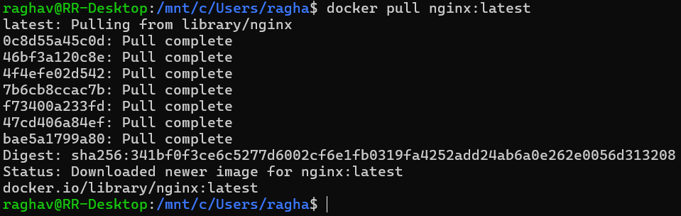
[cite_start]*Command:* `docker pull nginx:latest` [cite: 34]

### Step 2: Run the Container
We ran the container in detached mode (`-d`) naming it `nginx-official` and mapped port 8080 on the host to port 80 in the container.

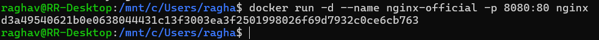
[cite_start]*Command:* `docker run -d --name nginx-official -p 8080:80 nginx` [cite: 37]

### Step 3: Verify
We verified the deployment by accessing the localhost URL. The response confirms the NGINX welcome page is active.

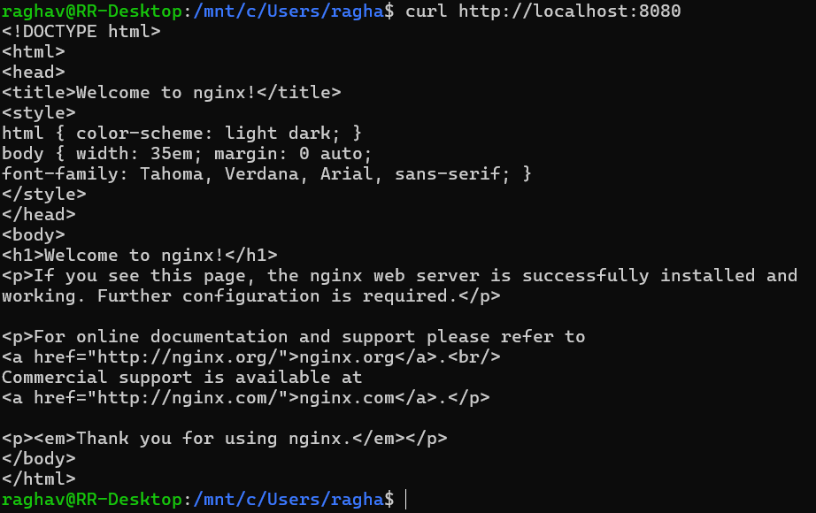
[cite_start]*Command:* `curl http://localhost:8080` [cite: 40]

### Key Observations
We checked the size of the downloaded official image.

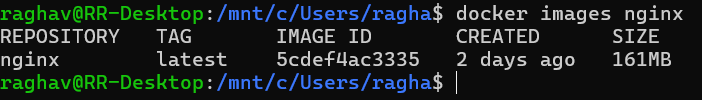
[cite_start]*Observation:* The official image size is approximately 161MB[cite: 101].

---

## Part 2: Custom NGINX Using Ubuntu Base Image

In this section, we built a custom image using `ubuntu:22.04` as the base. [cite_start]This approach results in a larger image but provides full OS utilities, which is useful for debugging[cite: 54, 70, 155].

### Step 1: Build the Image
We created a `Dockerfile` that installs NGINX on top of Ubuntu and built the image with the tag `nginx-ubuntu`.

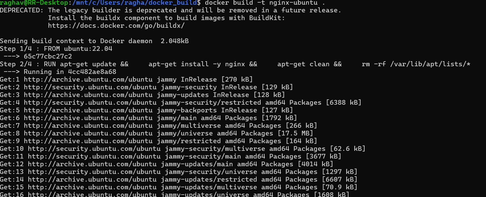
[cite_start]*Command:* `docker build -t nginx-ubuntu .` [cite: 62]

### Step 2: Run the Container
We ran the Ubuntu-based container on port 8081.

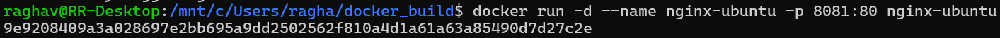
[cite_start]*Command:* `docker run -d --name nginx-ubuntu -p 8081:80 nginx-ubuntu` [cite: 65]

### Observations
The resulting image is significantly larger due to the inclusion of full OS utilities.

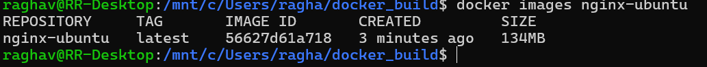
[cite_start]*Observation:* The image size is approximately 134MB[cite: 103].

---

## Part 3: Custom NGINX Using Alpine Base Image

We built a custom image using `alpine:latest`. [cite_start]Alpine Linux is a security-oriented, lightweight Linux distribution[cite: 73, 162].

### Step 1: Build Image
We built the image tagged `nginx-alpine`.

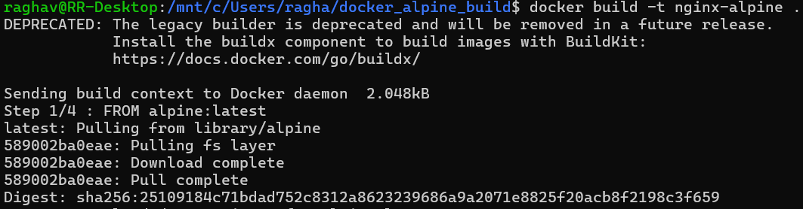
[cite_start]*Command:* `docker build -t nginx-alpine .` [cite: 85]

### Step 2: Run the Container
We ran the Alpine-based container mapping port 8082 to port 80.

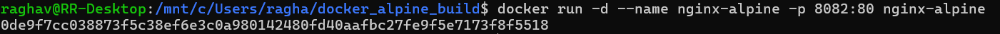
[cite_start]*Command:* `docker run -d --name nginx-alpine -p 8082:80 nginx-alpine` [cite: 88]

### Observations
The Alpine-based image is extremely small compared to the others.

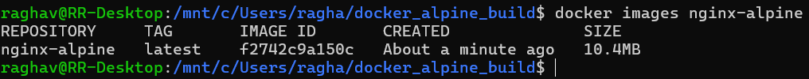
[cite_start]*Observation:* The image size is approximately 10.4MB[cite: 105].

---

## Part 4: Image Size and Layer Comparison

### Compare Sizes
We compared all three images side-by-side to visualize the size differences.

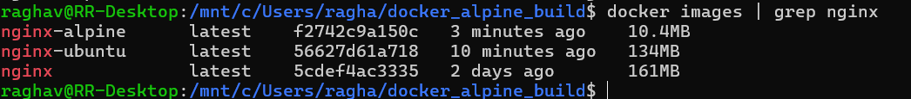

### Inspect Layers
We inspected the layer history of all three images.
* [cite_start]**Ubuntu** has many filesystem layers due to the full OS utilities[cite: 117].
* [cite_start]**Alpine** has minimal layers, contributing to its small size[cite: 118].
* [cite_start]**Official NGINX** is optimized but heavier than Alpine[cite: 119].

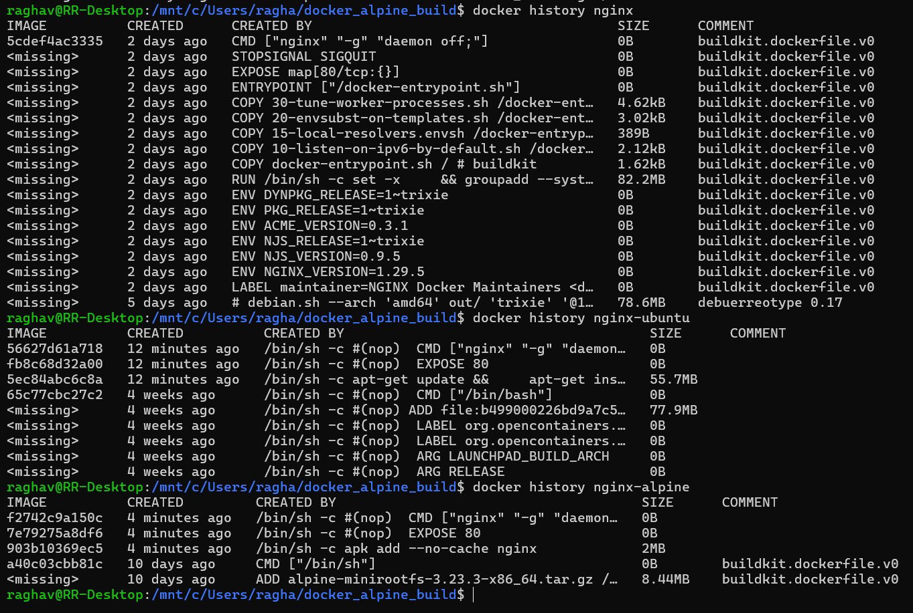
[cite_start]*Command:* `docker history nginx`, `docker history nginx-ubuntu`, `docker history nginx-alpine`[cite: 113, 114].

---

## Part 5: Functional Tasks (Serving Custom Content)

### Step 1: Create Custom HTML
We created a directory named `html` and added a custom `index.html` file.

*Commands:*
* [cite_start]`mkdir html` [cite: 122]
* [cite_start]`echo "<h1>Hello from Docker NGINX</h1>" > html/index.html` [cite: 123]

### Step 2: Run with Volume Mount
We ran a new container, mounting the local `html` directory to `/usr/share/nginx/html` inside the container. This allows NGINX to serve our custom file.

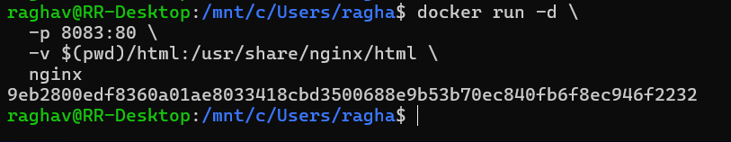
[cite_start]*Command:* `docker run -d -p 8083:80 -v $(pwd)/html:/usr/share/nginx/html nginx` [cite: 125-127]

---

## Part 6: Comparison Summary

| Feature | Official NGINX | Ubuntu NGINX | Alpine NGINX |
| :--- | :--- | :--- | :--- |
| **Image Size** | Medium | Large | Very Small |
| **Ease of Use** | Very Easy | Medium | Medium |
| **Startup Time** | Fast | Slow | Very Fast |
| **Debugging Tools** | Limited | Excellent | Minimal |
| **Security Surface** | Medium | Large | Small |
| **Production Ready** | Yes | Rarely | Yes |
[cite_start][cite: 147]

---

## Part 7: When to Use What

* [cite_start]**Official NGINX Image:** Recommended for production deployment, standard web hosting, and reverse proxy/load balancer use cases [cite: 149-152].
* [cite_start]**Ubuntu-Based Image:** Best for learning Linux/NGINX internals or when heavy debugging and custom system-level dependencies are required [cite: 153-156].
* [cite_start]**Alpine-Based Image:** Ideal for microservices, CI/CD pipelines, and cloud/Kubernetes workloads due to its small footprint [cite: 162-165].