# Experiment 4: Docker Essentials

**Topics Covered:**
- Dockerfile
- .dockerignore
- Tagging
- Publishing

---

## Part 1: Containerizing Applications with Dockerfile

### Step 1: Create a Simple Application

**Python Flask App:**

```bash
mkdir my-flask-app
cd my-flask-app
```

**`app.py`**
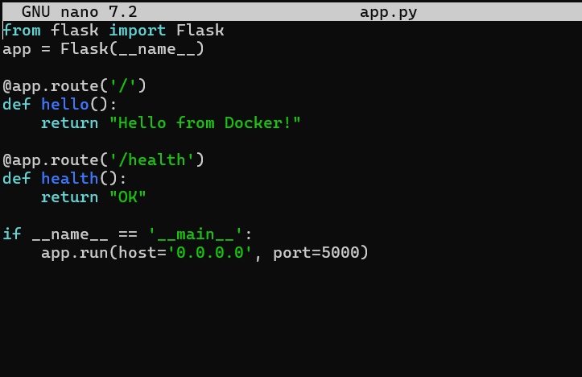

**`requirements.txt`**
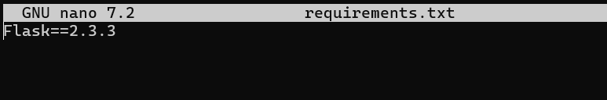

### Step 2: Create Dockerfile

**`Dockerfile`**
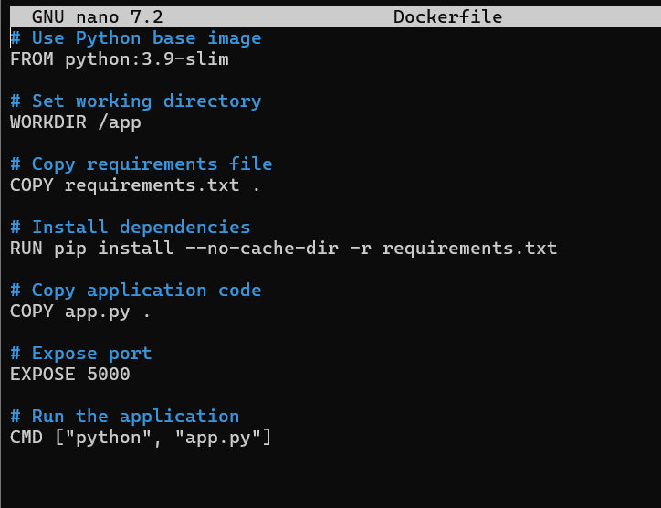

---

## Part 2: Using .dockerignore

### Step 1: Create .dockerignore File

**`.dockerignore`**
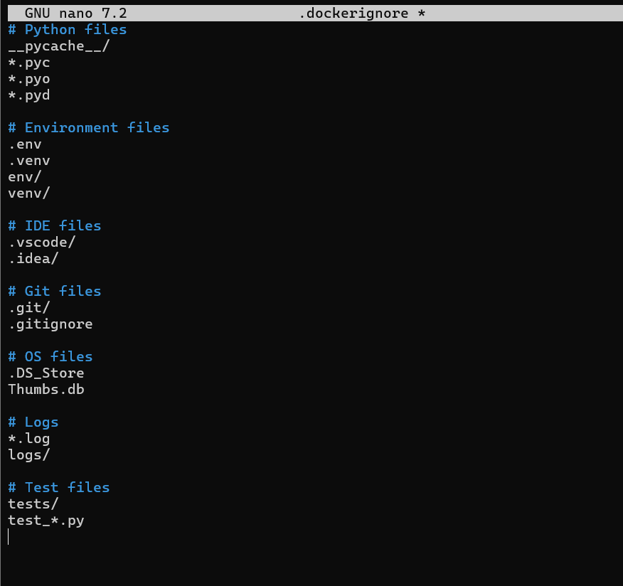

### Step 2: Why .dockerignore is Important
* Prevents unnecessary files from being copied
* Reduces image size
* Improves build speed
* Increases security

---

## Part 3: Building Docker Images

### Step 1: Basic Build Command

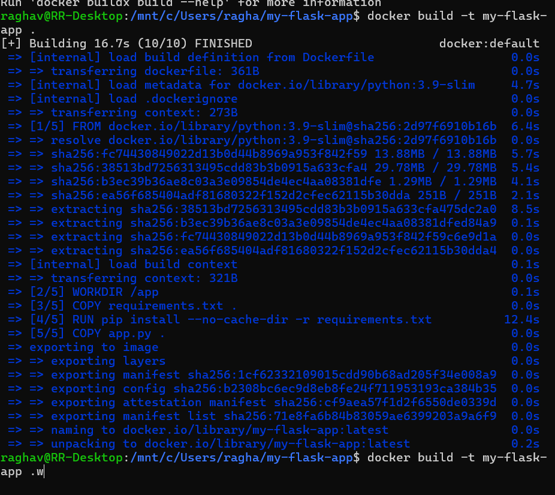
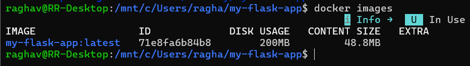

### Step 2: Tagging Images

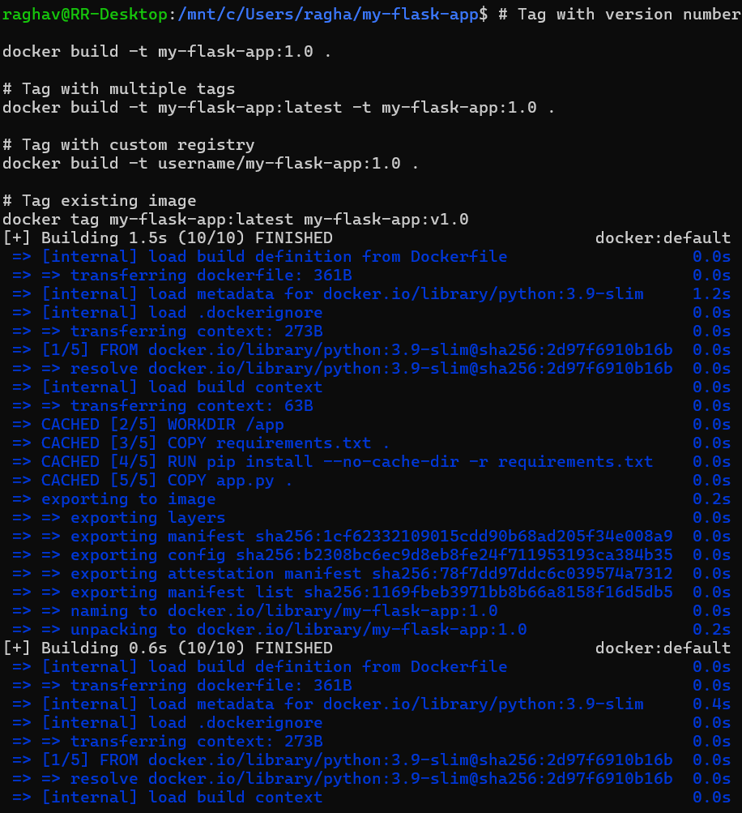

### Step 3: View Image Details

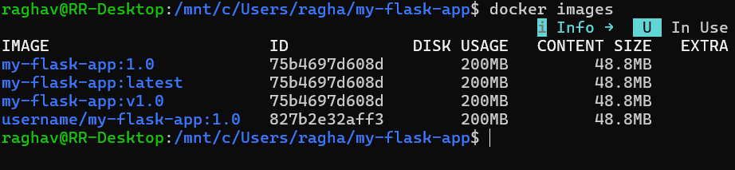

---

## Part 4: Running Containers

### Step 1: Run Container

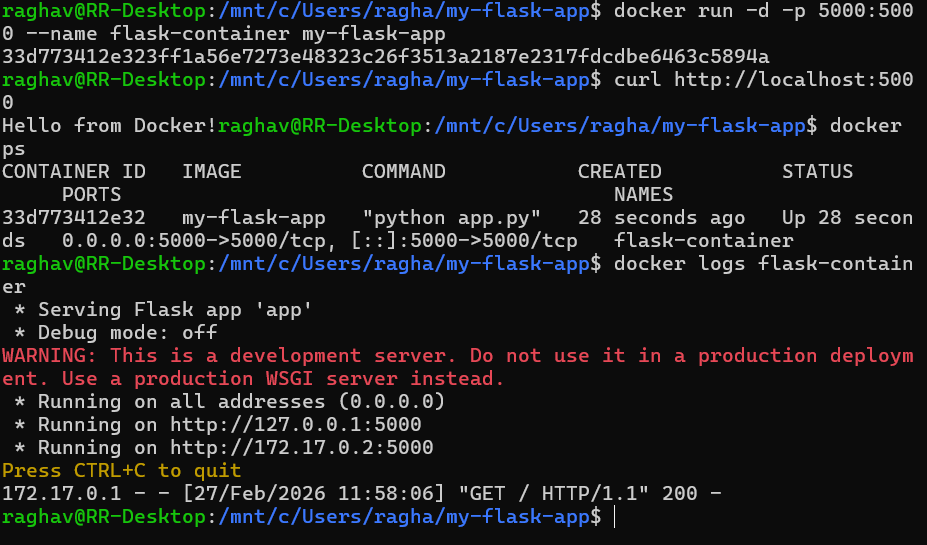

### Step 2: Manage Containers

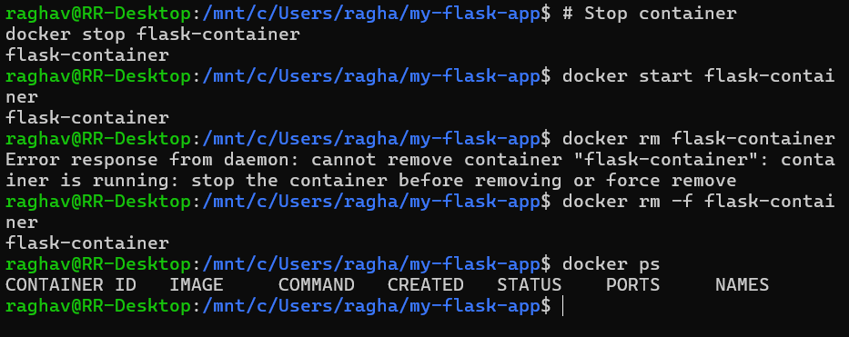

---

## Part 5: Multi-stage Builds

### Step 1: Why Multi-stage Builds?
* Smaller final image size
* Better security (remove build tools)
* Separate build and runtime environments

### Step 2: Simple Multi-stage Dockerfile

**`Dockerfile.multistage`**
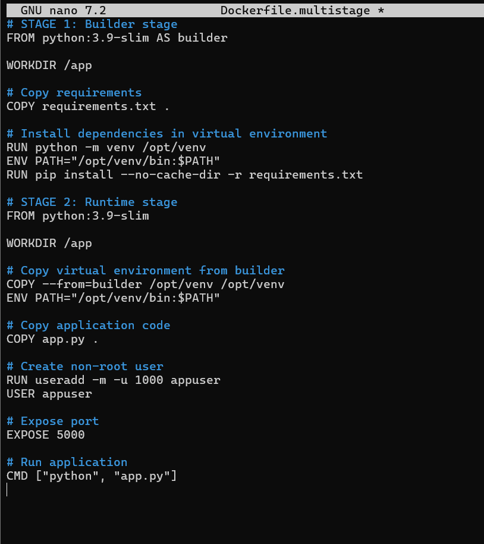

### Step 3: Build and Compare

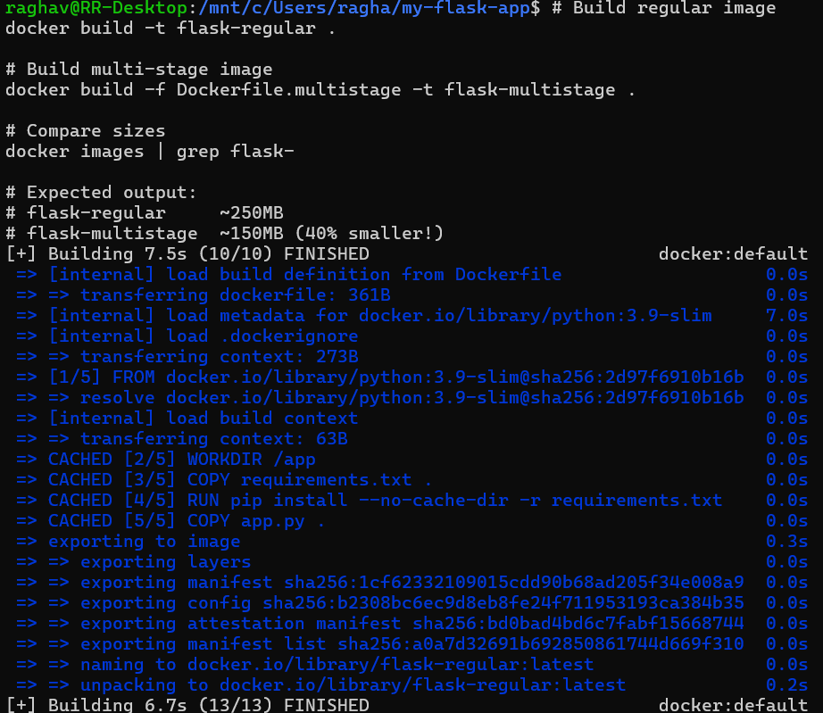
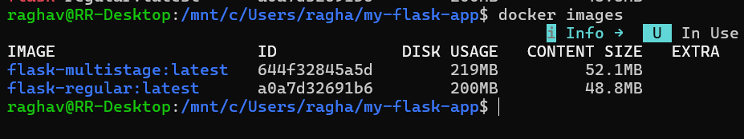

---

## Part 6: Publishing to Docker Hub

### Step 1: Prepare for Publishing

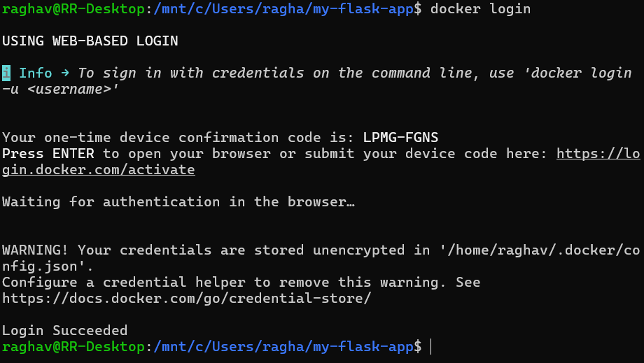
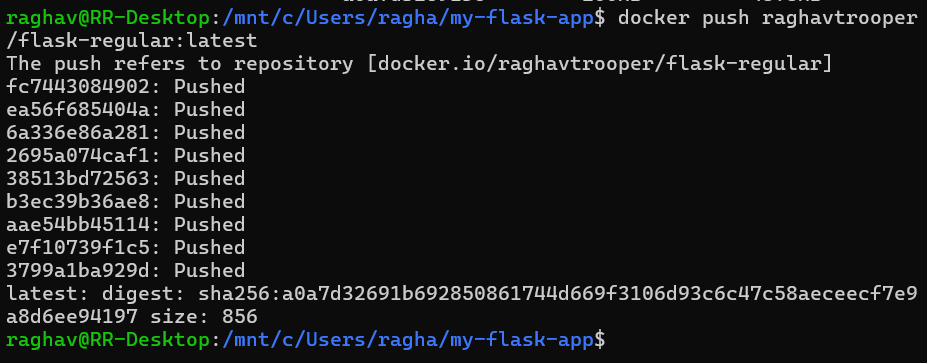

### Step 2: Pull and Run from Docker Hub

```bash
# Pull from Docker Hub (on another machine)
docker pull username/my-flask-app:latest

# Run the pulled image
docker run -d -p 5000:5000 username/my-flask-app:latest
```

---

## Part 7: Node.js Example (Quick Version)

### Step 1: Node.js Application

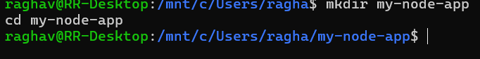

**`app.js`**
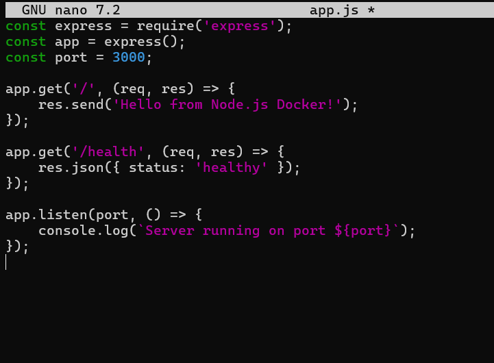

**`package.json`**
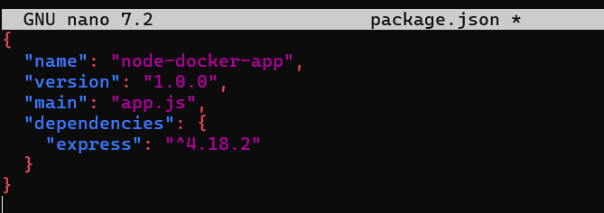

### Step 2: Node.js Dockerfile

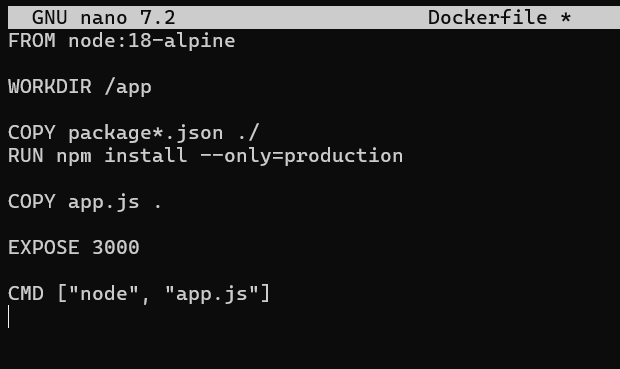

### Step 3: Build and Run

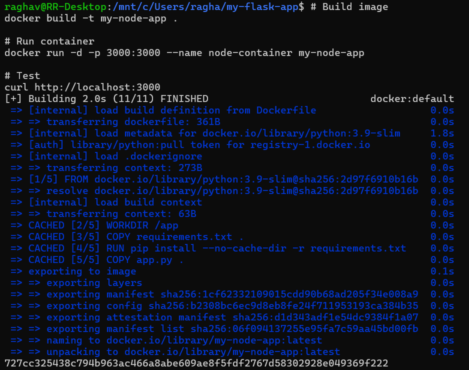
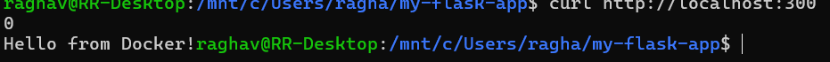

---

## Part 8: Quick Practice Exercises

**Exercise 1: Tagging Practice**
```bash
# Create an image with three tags:
# 1. myapp:latest
# 2. myapp:v2.0
# 3. yourusername/myapp:production

# Solution:
docker build -t myapp:latest -t myapp:v2.0 -t username/myapp:production .
```

**Exercise 2: Multi-stage for Node.js**
```dockerfile
# Create a multi-stage Dockerfile for Node.js that:
# 1. Uses builder stage for npm install
# 2. Creates final image with only production dependencies
# 3. Uses non-root user

# Hint:
# STAGE 1: FROM node:18-alpine AS builder
# STAGE 2: FROM node:18-alpine
# COPY --from=builder /app/node_modules ./node_modules
```

**Exercise 3: Clean Build**
```bash
# Build without cache and with .dockerignore
docker build --no-cache -t clean-app .

# Compare with cached build
time docker build -t cached-app .
```

---

## Essential Docker Commands Cheatsheet

| Command | Purpose | Example |
| :--- | :--- | :--- |
| `docker build` | Build image | `docker build -t myapp .` |
| `docker run` | Run container | `docker run -p 3000:3000 myapp` |
| `docker ps` | List containers | `docker ps -a` |
| `docker images` | List images | `docker images` |
| `docker tag` | Tag image | `docker tag myapp:latest myapp:v1` |
| `docker login` | Login to Dockerhub | `echo "token" | docker login -u username --password-stdin` |
| `docker push` | Push to registry | `docker push username/myapp` |
| `docker pull` | Pull from registry | `docker pull username/myapp` |
| `docker rm` | Remove container | `docker rm container-name` |
| `docker rmi` | Remove image | `docker rmi image-name` |
| `docker logs` | View logs | `docker logs container-name` |
| `docker exec` | Execute command | `docker exec -it container-name bash` |

---

## Common Workflow Summary

**Development Workflow:**
```bash
# 1. Create Dockerfile and .dockerignore
# 2. Build image
docker build -t myapp .

# 3. Test locally
docker run -p 8080:8080 myapp

# 4. Tag for production
docker tag myapp:latest myapp:v1.0

# 5. Push to registry
docker push myapp:v1.0
```

**Production Workflow:**
```bash
# 1. Pull from registry
docker pull myapp:v1.0

# 2. Run in production
docker run -d -p 80:8080 --name prod-app myapp:v1.0

# 3. Monitor
docker logs -f prod-app
```

---

## Key Takeaways
1. **Dockerfile** defines how to build your image.
2. **.dockerignore** excludes unnecessary files (important for security and performance).
3. **Tagging** helps version and organize images.
4. **Multi-stage builds** create smaller, more secure production images.
5. **Docker Hub** allows sharing and distributing images.
6. Always test images locally before publishing.

## Cleanup

```bash
# Remove all stopped containers
docker container prune

# Remove unused images
docker image prune

# Remove everything unused
docker system prune -a
```