# Experiment 9: Ansible Lab Report

## 1. Objective
To understand and implement infrastructure configuration management using Ansible. The experiment demonstrates how to provision, configure, and manage multiple remote servers (simulated using Docker containers) simultaneously from a single control node without installing any agent software on the managed nodes.

## 2. Theory
Ansible is an open-source automation tool used for configuration management, application deployment, and orchestration. 
* **Agentless Architecture:** It does not require any background agents on the target machines, relying entirely on standard SSH for Linux environments.
* **Idempotency:** Playbooks can be run multiple times safely; Ansible only makes changes if the system does not match the desired state.
* **Playbooks:** Uses human-readable YAML syntax to define tasks, ensuring Infrastructure as Code (IaC) principles.
* **Inventory:** A file defining the list of managed nodes (target servers) that Ansible will connect to.

## 3. Environment Setup
**Prerequisites:** * Windows Subsystem for Linux (WSL) running Ubuntu (Control Node).
* Docker Desktop configured to integrate with WSL.  
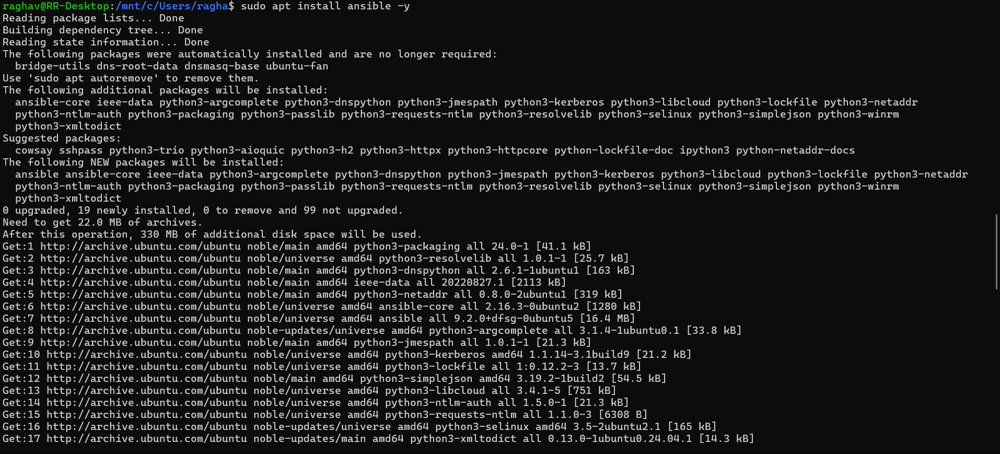  
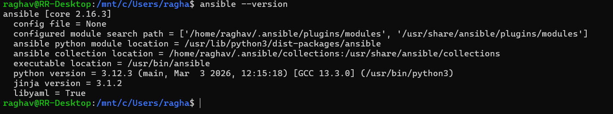  
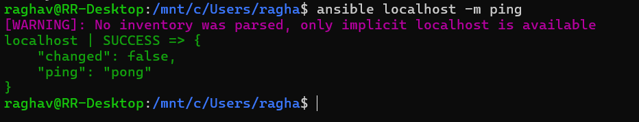

### 3.1 Generating SSH Keys
To allow Ansible to connect to the target nodes without passwords, an SSH key pair was generated on the control node.    
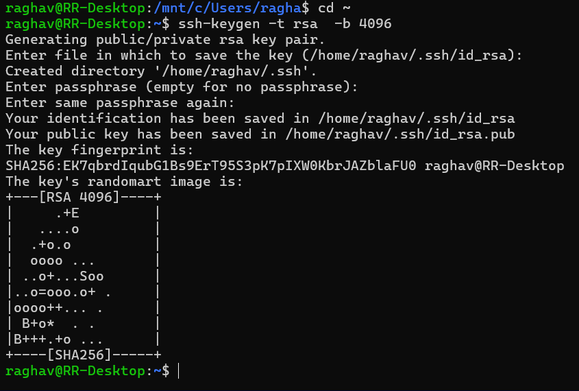  
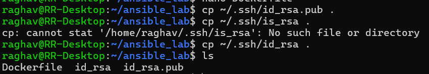

### 3.2 Building the Target Docker Image
A custom `ubuntu-server` Docker image was created to simulate the managed nodes. It installs `openssh-server`, Python (required by Ansible), and imports the generated SSH keys.

**Dockerfile:**  
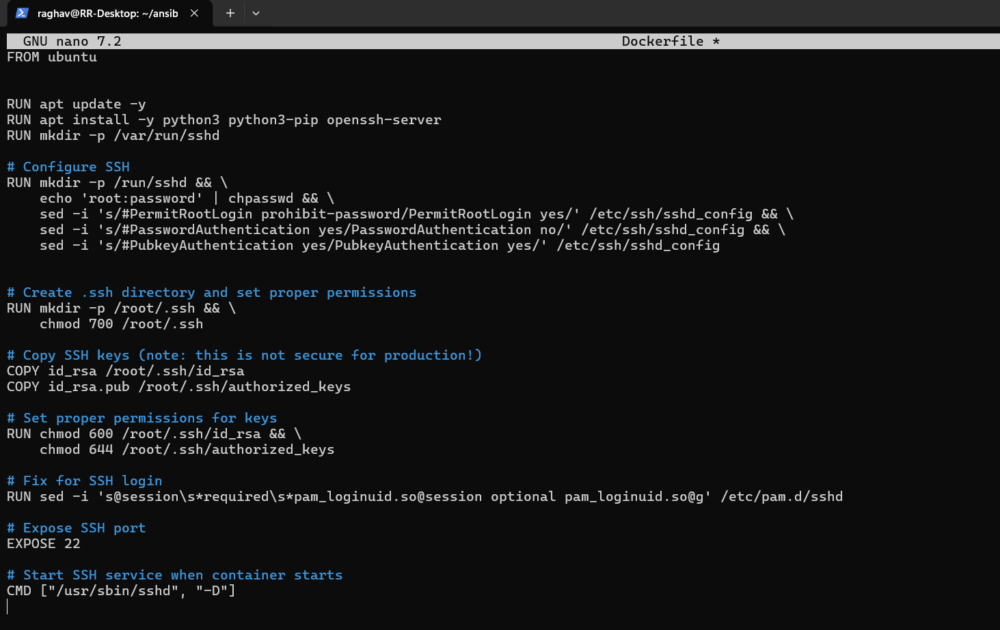  

**Build Command:**  
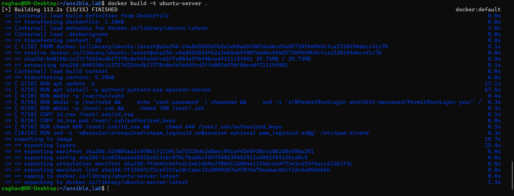  

building a test container.  
  
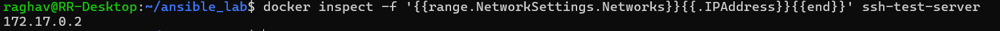  
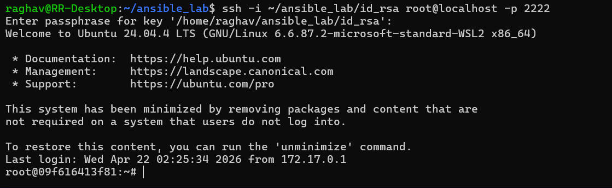  

removing the container.  
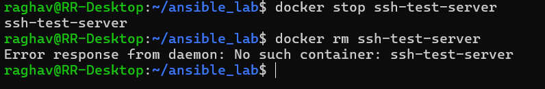

## 4. Implementation Steps

### 4.1 Provisioning the Managed Nodes
Four Docker containers (`server1` to `server4`) were spun up in the background to act as the infrastructure.  
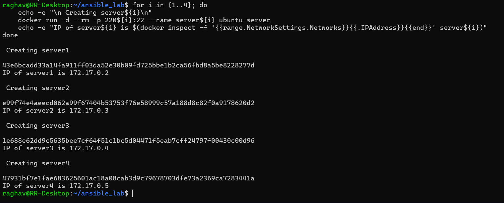  

### 4.2 Creating the Ansible Inventory
An `inventory.ini` file was dynamically generated to tell Ansible how to reach the containers using their internal Docker IP addresses and the custom SSH key.  
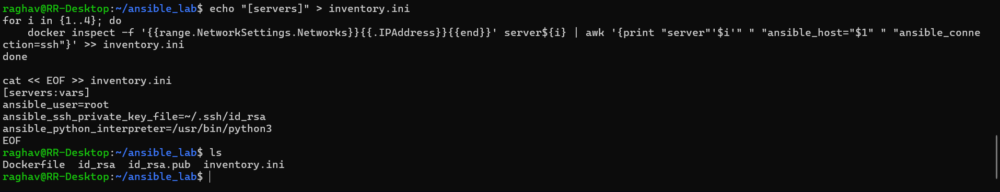

### 4.3 Testing Connectivity (Ping Module)
To verify Ansible could communicate with all four nodes, the `ping` module was used. Strict host key checking was temporarily disabled to bypass the simultaneous SSH fingerprint prompts for the new containers.
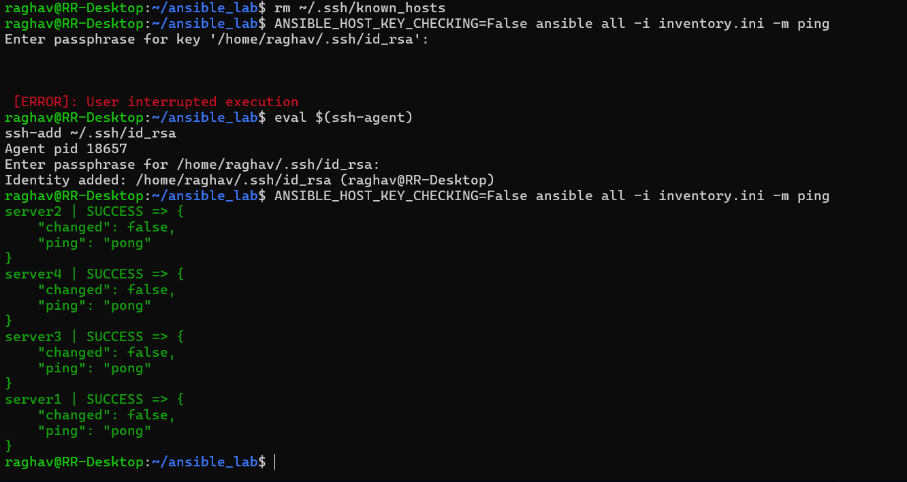

### 4.4 Creating and Executing the Playbook
A playbook was created to automate the configuration of all four servers simultaneously: updating apt packages, installing tools (`vim`, `htop`, `wget`), and writing a custom text file.

**playbook1.yml:**  
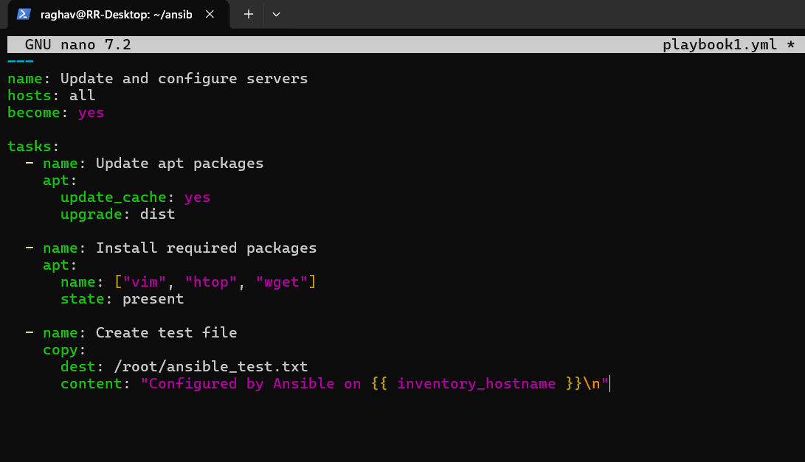  

**Execution Command:**  
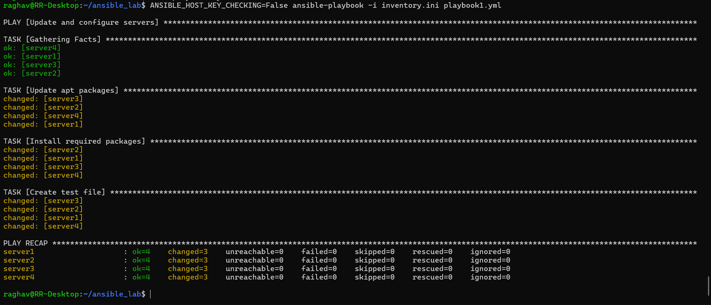

### 4.5 Verification and Cleanup
Changes were verified across the cluster using Ansible ad-hoc commands to read the newly created text file on all nodes simultaneously.  
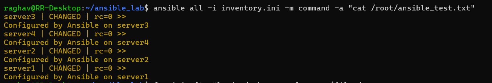

Once verified, the infrastructure was torn down by stopping and removing the Docker containers:  
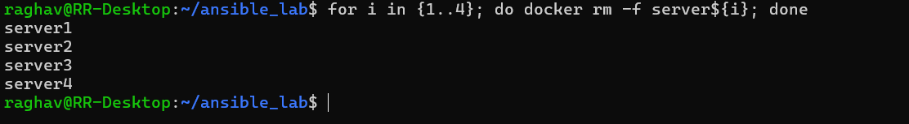

## 5. Conclusion
This experiment successfully demonstrated the core workflow of Ansible. By using a single control node, we were able to seamlessly provision, connect to, and configure multiple remote systems simultaneously using an automated YAML playbook. This highlights Ansible's value in reducing manual configuration drift and improving scalability in infrastructure management.