# Task: Dockerize Python FastAPI Server with GitHub Actions and Upload to Docker Registry

## Continuous Delivery with GitHub Actions

### What is Continuous Delivery (CD)

Continuous Delivery (CD) is a DevOps practice where code changes are:

1. Automatically built
2. Automatically tested
3. Automatically prepared for release

Key idea:
Every change pushed to the repository is always in a deployable state.

### Difference from Continuous Deployment

| Concept | Meaning |
|-------|-------|
| Continuous Delivery | Code is ready to deploy, but deployment may be manual |
| Continuous Deployment | Code is automatically deployed to production |

### Flow of Continuous Delivery

Developer → Git Push → CI Pipeline → Build → Test → Package → Ready to Deploy

In this experiment:

GitHub → GitHub Actions → Build Docker Image → Push to Docker Hub

# How GitHub Actions Works

GitHub Actions is a CI/CD tool built into GitHub that allows automation using workflows.

## Core Concepts

### 1. Workflow
Defined in:
.github/workflows/*.yml

Describes automation steps.

### 2. Event Trigger
Defines when workflow runs.

Example:
on: push

### 3. Job
A set of steps running on a machine.

Example:
jobs:
  build:

### 4. Runner
Machine where job runs.

Example:
runs-on: ubuntu-latest

### 5. Steps
Individual commands or actions.

Example:
steps:
- uses: actions/checkout@v1

# Execution Flow

When you push code:

1. GitHub detects event (push)
2. Workflow file is read
3. Runner (VM) is created
4. Steps are executed:
   - Clone repo
   - Login to Docker
   - Build image
   - Push image

# Part I: Hands-On – Dockerize FastAPI + GitHub Actions

To test this experiment we need a new GitHub repository.

## Step 1: Create Repository

Create a new repository on GitHub.

https://github.com/new

Optionally add README.md and keep it private.

Your repository should include:

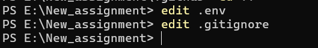  
.env  
.gitignore  

Example:

.env
DOCKERTOKEN=tokengeneratedfromdockerhub

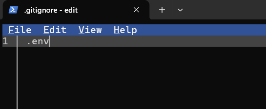 

Example directory structure:

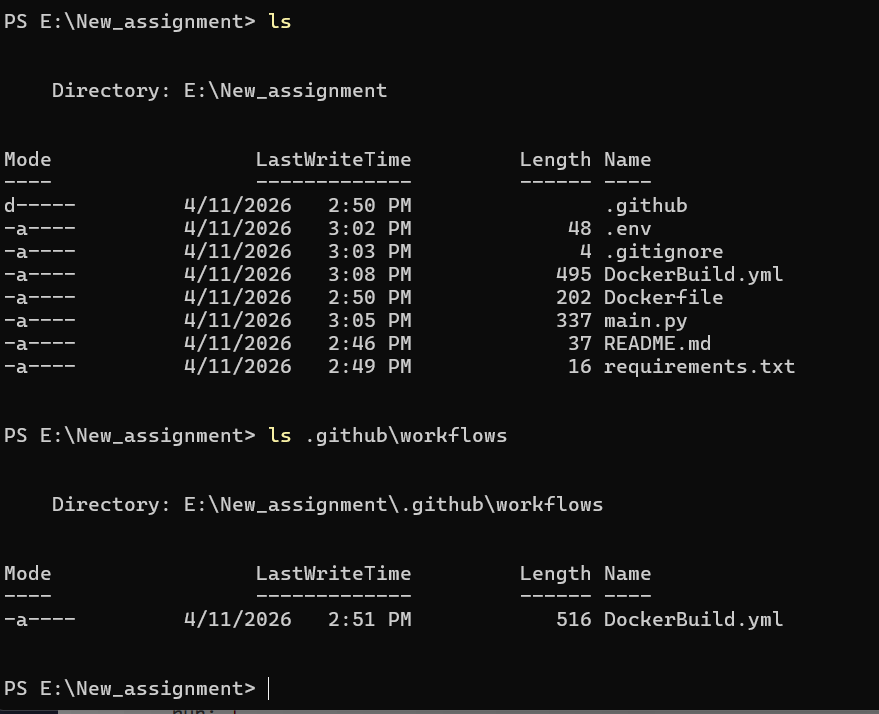 

# Step 1: FastAPI Application

main.py

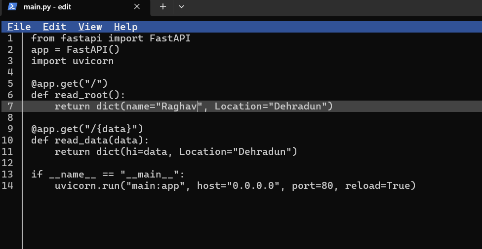 

# Step 2: Requirements

requirements.txt

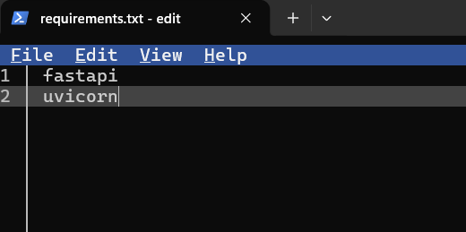 

# Step 3: Dockerfile

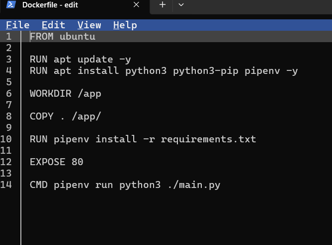 

# Step 4: GitHub Actions Workflow

.github/workflows/DockerBuild.yml
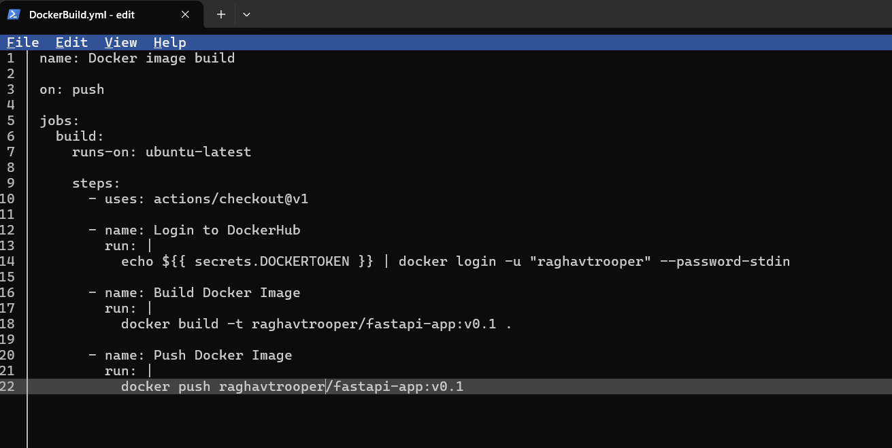 

# Step 5: Create Docker Token

1. Go to https://hub.docker.com
2. Account Settings → Security → Access Tokens
3. Generate token
4. Copy it

# Step 6: Add Secret in GitHub

Go to:

https://github.com/<username>/<repo>/settings/secrets/actions

Add secret:

Name: DOCKERTOKEN
Value: <your token>
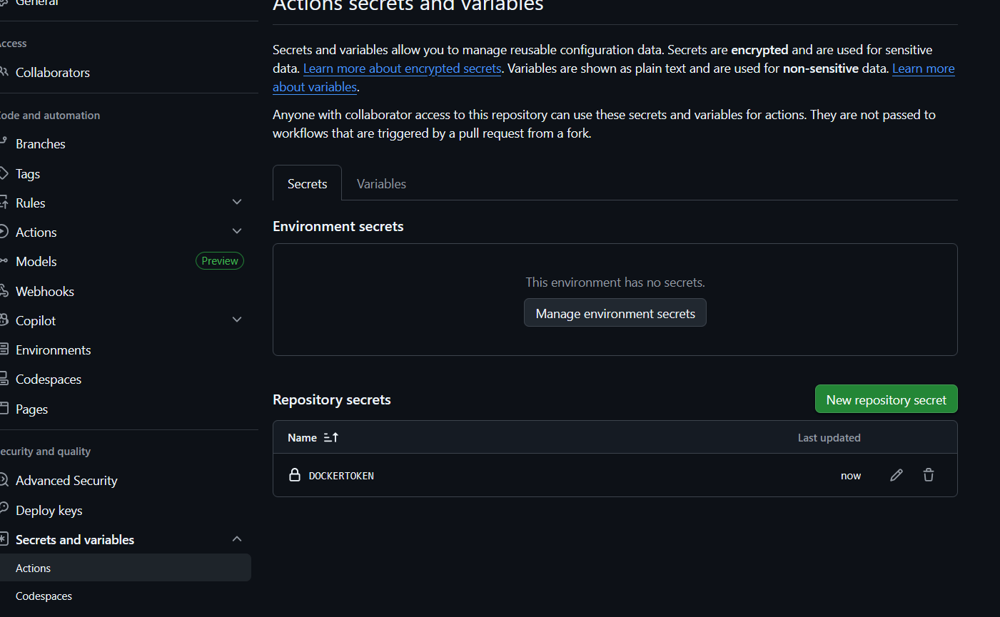 

# Final Flow

You push code →
GitHub Actions triggers →
Docker image builds →
Image pushed to Docker Hub

# Optional: Test Locally (WSL Docker)

docker build -t fastapi-app .
docker run -p 80:80 fastapi-app

Open:

http://localhost

# Summary

| Step | Purpose |
|-----|-----|
| FastAPI App | Backend API |
| Dockerfile | Containerize app |
| GitHub Actions | Automate build and push |
| Docker Token | Secure authentication |
| Secret | Safe storage in GitHub |

# Part II – Verification Task

Validate Full CI/CD Flow.

This ensures:

- GitHub Actions works correctly
- Docker image updated on Docker Hub
- Latest changes appear in container

# Task 1: Modify Application Response

Update main.py:

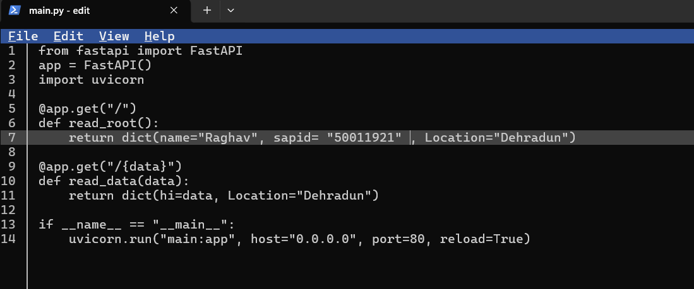 

# Task 2: Commit and Push

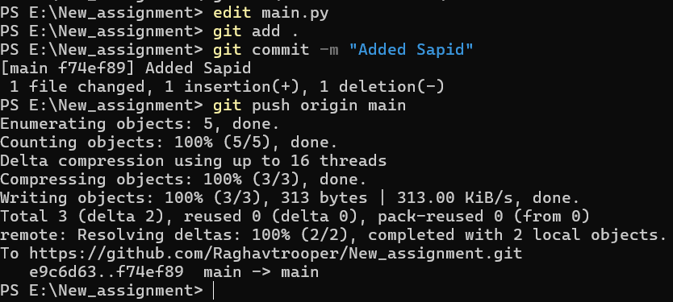 

# Task 3: Verify GitHub Actions

1. Go to repository
2. Open Actions tab
3. Check latest workflow run

Expected:

Build → Success  
Push → Success  
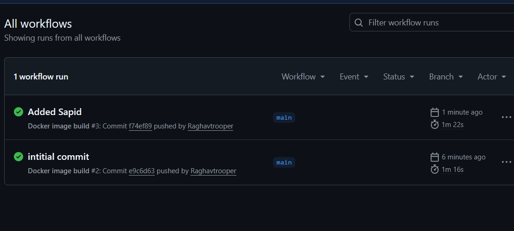  
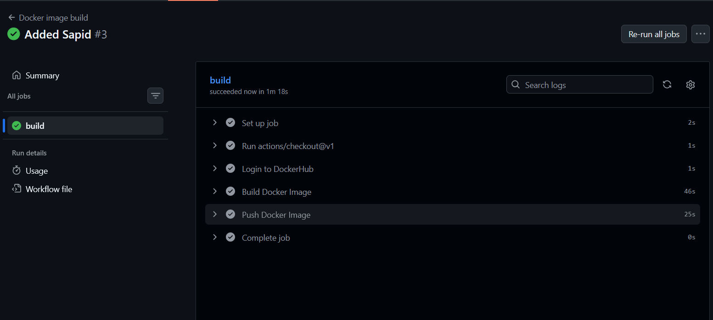  

# Task 4: Verify Docker Hub

Check your Docker Hub repository:

- Latest tag (v0.1) updated
- Timestamp reflects new push

# Task 5: Run Updated Image

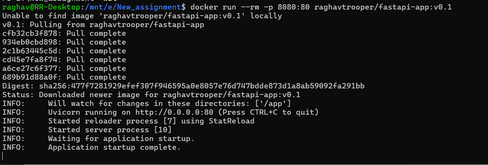 

# Task 6: Validate Output

Open browser:

http://localhost:8080

Expected response:

{
"name": "Your Name",
"sapid": "YOUR_SAP_ID",
"Location": "Dehradun"
}
 

# What This Confirms

| Check | Verified |
|------|------|
| Code change detected | Yes |
| GitHub Actions triggered | Yes |
| Docker image rebuilt | Yes |
| Image pushed to registry | Yes |
| Latest container reflects change | Yes |

# Common Issues

GitHub Action failed:

- Check logs in Actions tab
- Verify DOCKERTOKEN secret

# Final Outcome

You validated a complete pipeline:

Code Change → Git Push → GitHub Actions → Docker Build → Docker Push → Local Run → Verified Output